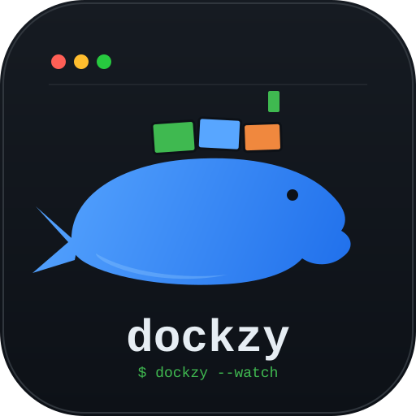

<p align="center">
  
</p>

<h1 align="center">dockzy</h1>

<p align="center">
  A terminal UI for managing Docker — in the style of <a href="https://github.com/jesseduffield/lazydocker">lazydocker</a>.
</p>

<p align="center">
  
  
  
</p>

---

`dockzy` is a single-binary terminal dashboard for Docker: containers, live CPU,
logs, stats, config and `top`, all in one keyboard-driven screen — no browser,
no `docker` subcommands to remember.

## Features

- **Live container list** — services (grouped by `com.docker.compose.service`)
  and standalone containers, split into their own panels.
- **Live CPU%** — one stats stream per running container, updated in place,
  no polling/refresh needed.
- **Per-container detail tabs** — Logs, Stats, Config and `top`, fetched the
  moment you select a row and cancelled cleanly if you move on before they land.
- **Full keyboard navigation** — cycle panels with `Tab` / `Shift+Tab`, move
  through tabs with the arrow keys, quit with `q`.
- **Zero external dependencies at runtime** — talks straight to the Docker
  daemon over its socket via [`moby/moby/client`](https://github.com/moby/moby).

## Status

Early-stage. Container listing, live CPU, and the Logs/Stats/Config/Top panel
are wired up to the real Docker daemon. Images and Volumes are still mocked
(`internal/docker/mock.go`) — see [`docs/ARCHITECTURE.md`](docs/ARCHITECTURE.md#42-recipe-static-feature-no-stream)
for the exact recipe to swap them for the real API.

## Install & run

Requires Go 1.26+ and a reachable Docker daemon (`DOCKER_HOST` or the default
socket).

```bash
git clone https://github.com/Gabriel-Valin/dockzy.git
cd dockzy
go run .
```

No Docker environment handy? `docker-compose.yml` spins up a small
Postgres/Redis/Nginx stack you can point dockzy at:

```bash
docker compose up -d
go run .
```

## Keybindings

| Key                | Action                                            |
| ------------------ | -------------------------------------------------- |
| `Tab` / `Shift+Tab` | Cycle focus: Services → Standalone → Images → Volumes → right panel |
| `↑` / `↓`           | Move selection within the focused list              |
| `←` / `→`           | Switch tab (Logs/Stats/Config/Top) when the right panel is focused |
| `q`                 | Quit (cancels every in-flight stream first)         |

## How it's built

```
main.go                    entrypoint — calls app.Run()
internal/
├── docker/   talks to the Docker daemon (no tview import)
├── ui/       tview widgets (no Docker client import)
└── app/      composition root — wires docker + ui, owns every goroutine
```

`docker` never imports `tview`; `ui` never imports the Docker client — each
side can be read and reasoned about on its own, and `app` is the only place
that knows both exist. The full writeup — data flow, the live-CPU stream,
container selection, and a step-by-step recipe for adding a new panel value —
lives in [`docs/ARCHITECTURE.md`](docs/ARCHITECTURE.md).

## Contributing

This is a personal, early-stage project — issues and PRs are welcome, but
expect the internals to shift. Read [`docs/ARCHITECTURE.md`](docs/ARCHITECTURE.md)
first; it documents the exact shape a new feature (static or streamed) is
expected to take.
